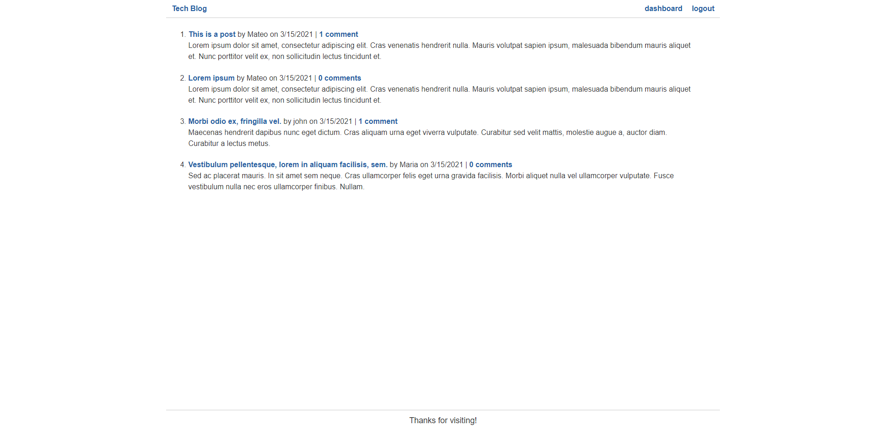
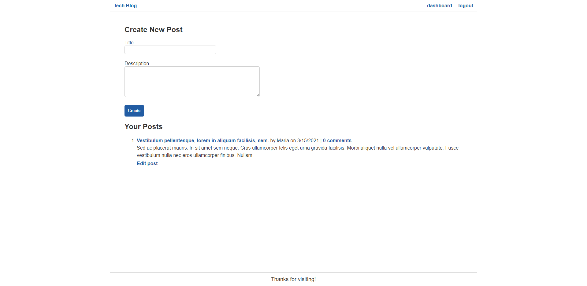
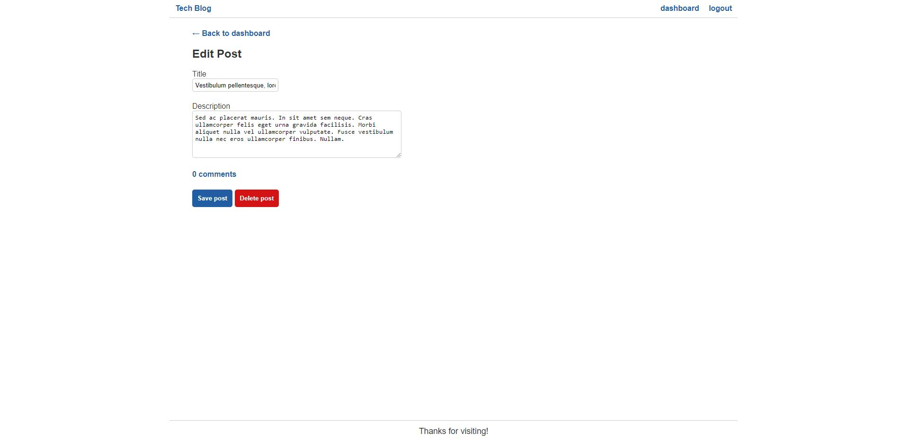
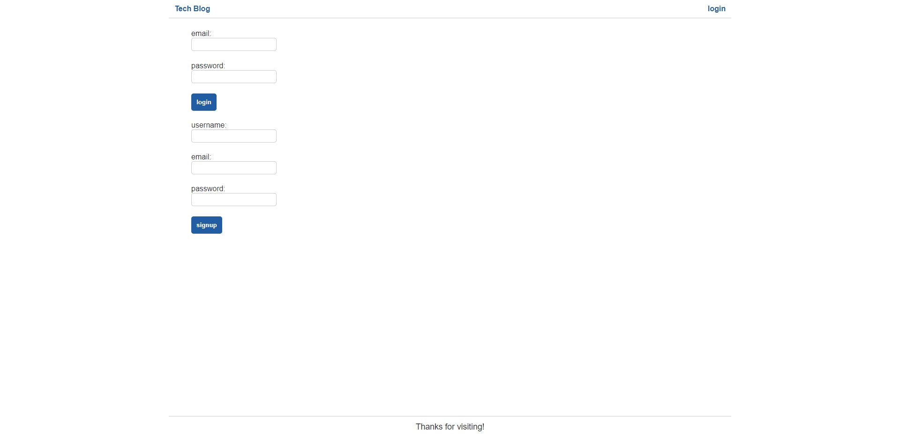

# tech blog
  

  ## Table of Contents
  - [Description](#description)
  - [Screenshots](#screenshots)
  - [Installation](#installation)
  - [Contribute](#contribute)
  - [License](#license)
  - [Questions](#questions)

  ## Description
  a CMS-style blog site similar to a Wordpress site, where developers can publish their blog posts and comment on other developers’ posts as well. app will follow the MVC paradigm in its architectural structure, using Handlebars.js as the templating language, Sequelize as the ORM, and the express-session npm package for authentication.

  ## Screenshots
  
   
  
   
  
   
  

  ## Installation
  git clone then you’ll need to use the [express-handlebars](https://www.npmjs.com/package/express-handlebars) package to use Handlebars.js for your Views, use the [MySQL2](https://www.npmjs.com/package/mysql2) and [Sequelize](https://www.npmjs.com/package/sequelize) packages to connect to a MySQL database for your Models, and create an Express.js API for your Controllers. 
  
  You’ll also need the [dotenv package](https://www.npmjs.com/package/dotenv) to use environment variables, the [bcrypt package](https://www.npmjs.com/package/bcrypt) to hash passwords, and the [express-session](https://www.npmjs.com/package/express-session) and [connect-session-sequelize](https://www.npmjs.com/package/connect-session-sequelize) packages to add authentication.

  ## Contribute
  Mateo
  
  ## License
  MIT

  ## Questions
  [@cruzma](https://github.com/cruzma) 